# DicasGit

## Mantedores
Esse repositorio é mantido por alunos da UNIVESP

## Obejetivo
O objetivo desse repositorio é organizar e categorizar em um unico local dicas uteis para a utilização do Git assim como do Github e/ou Gitlab

# Instalação do Git
Para realizar a instalação do git na maquina siga esse script.
>Obs. As imagem sempre vão conter as opções declaradas como sugestão para facilitar a localização das mesmas.

## 1. Download
Efetue o download da ultima versão no link
`https://git-scm.com/downloads` selecionando seu OS corretamente

## 2. Instalação
### 2.1 Windows

Realize o download no site `https://git-scm.com/download/win` selecionando a versão `Standalone Installer` do seu sistema opercional ( 32bit ou 64bit).

Inicie a instalação executando o binario 
`Git-X.XX.X-XX-bit.exe`.

Leia e aceite os termos precionando em `Next`.

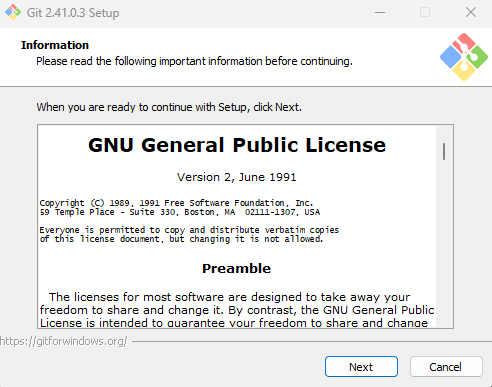

Selecione o local de instalação ou mantenha o padrão `C:\Program Files\Git` e precione `Next` para continuar.

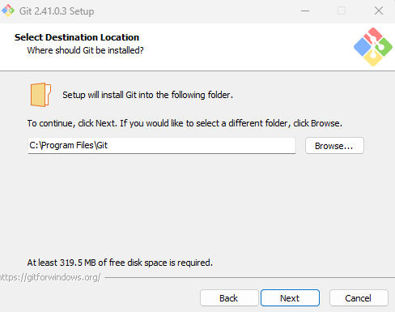

Na tela de componentes selecione os que deseja instalar, precione `Next` para continuar
>Como sugestão mantenha o padrão e adicione o item `Additional icons > On the Desktop`

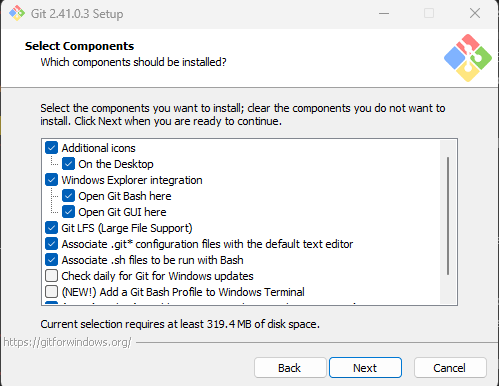

Selecione como o atalho do programa sera identificado na maquina
>Sugestão mantenha o padrão `git`

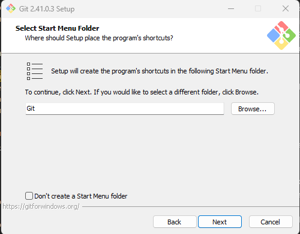

Na tela de seleção do editor padrão, selecione o editor de sua preferencia.
> Sugestão: Recomendamos fortemente utilizar o notepad ou notepad++ pela sua facilidade, o editor VIM que vem como padrão tem um alto grau de complexidade para ser utilizado.

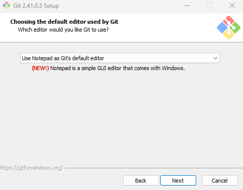

Na proxima tela sera solicitado qual a **BRANCH** padrão a ser criada quando inicializar um novo repositorio.

> Seguestão: Mude para a opção `Override the default branch name for new repositories` e digite o nome `main`, o nome padrão `master` está em desuso por motivos de inclusoes sociais e deve ser evitado, além de que sempre traremos conteudo utilizando a referencia a **Main**. Para mais informações acesse:
> 
> https://sempreupdate.com.br/github-substituira-master-por-main-a-partir-do-proximo-mes/ [PT-BR]
> https://sfconservancy.org/news/2020/jun/23/gitbranchname/ [en]

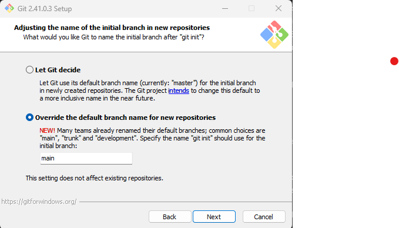

Na proxima tela, será selecionado os programas adicionais a serem instalados junto do git na maquina. Selecione a sua preferencia e precione `NEXT`
> Sugestão: Deixe o padrão (2ª Opção), instalando somente o Git Bash (1ª opção) irão faltar ferramentas de apoio para o Git e instalando a o opção com as ferramentas **Unix** (3ª Opção) pode ocorrer de softwares nativos do Windows pare de funcionar corretamente

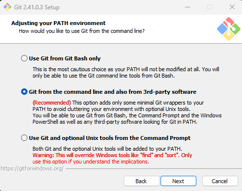

Na proxia tela, temos a seleção de programas para realizar conexões remotas, necessario para a comunicação com repositorios externos como o Gitlab e Github. Selecione o preferido
> Sugestão: Mantenha o padrão `Use bundled OpenSSH`, as outras opções são para casos especificos e podem não funcionar corretamente.

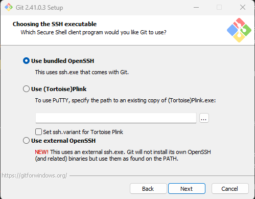

Na proxima tela, selecione qual o metodo de validação de certificados será utilizado.
> Sugestão: Mantenha o padrão do git.

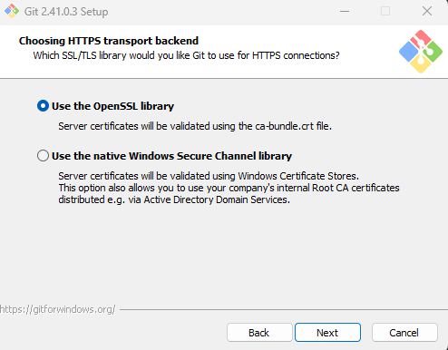

Na proxia tela, será selecionado como o git vai trabalhar com a quebra de linhas, por convenção são utilizada as quebras de linha do **Unix** [`LF`].
> Segestão deixe a versão padrão `Checkout Windows-style, commit Unix-style line endings`, isso evitara problemas quando o codigo ou texto for criado por um linux e aberto no windows e vice e versa.

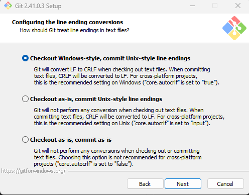

Nessa tela será decidido qual o Emuladore de terminal que o Git utilizara por padrão.
> Sugestão: Utilize o MinTTY, por conta de conseguir intrepretar melhor os atalhos do teclado assim como possiveis acentos e outros caracteres especiais não ingleses

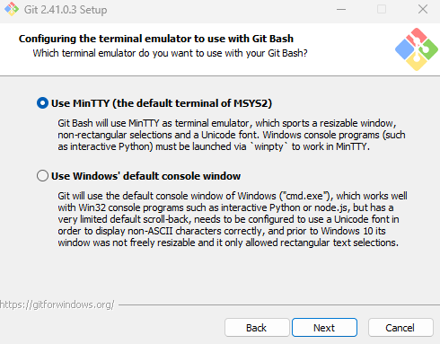

Na proxima tela será escolhido qual o padrão para o comando `git pull`.
> Sugestão: mantenha o padrão `Default (fast-foward or merge)` assim o git ira definir qual a melhor estrategia.

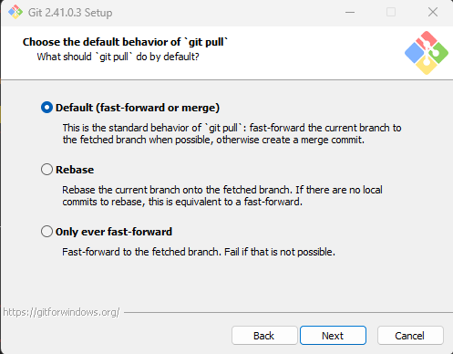

Na proxima tela será escolhido o tipo de gerenciador de credenciais que o git utilizará por padrão.
> Sugestão utilize o padrão `Git Credential Manager` assim ira evitar de toda hora precisar colocar a senha do repositorio remoto

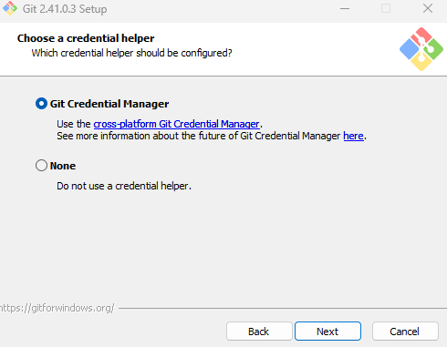

Nessa penultima tela vamos definir a opções extras do git.
>Sugestão: Mantenha o padrão informado pelo Git a menos que tenha alguma necessidade especial.

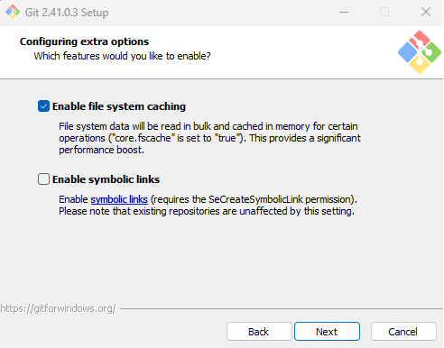

Na ultima tela vamos escolher as opções experimentais do Git.
> Sugestão: Não recomendo ativar nenhuma opção a menos que deseje efetuar testes com as mesmas.

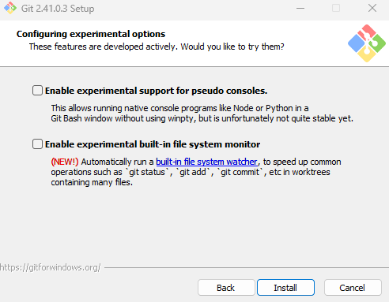

Precione `install`para a instalação se inicie

## 3. Comandos mais utilizados

- `git init` => Inicializa um repositorio na pasta atual
- `git clone [url]` => Faz o download completo do repositorio informado **[URL]**
- `git status` => mostra os arquivos modificados na pasta atual.
- `git add` => adiciona um novo arquivo ao seu proximo **commit**
- `git commit -m "[Mensagem sobre o commit]"` => Efetua um **commit** dos arquivos com a mensagem selecionada
- `git branch` => Mostra todas as **branchs** disponiveis, Um *(asterisco) ira aparecer na frente da **branch** atual
- `git branch [nome-da-branch]` => cria uma nova **branch** [nome-da-branch] apartir do commit atual
- `git checkout [nome-da-branch]` => Muda para a **branch** [nome-da-branch] escolhida
- `git checkout -b [nome-da-branch]` => muda para a **branch** [nome-da-branch] e caso a mesma não exista, cria uma com o mesmo nome.
- `git merge [branch]` => Faz a mescla entre a **branch** escolhida na **branch** atual
- `git log` => mostra o historico da **branch** atual
- `git diff` [BranchA...BranchB] => faz a comparação entre 2 **Branchs**
- `git remote add [alias] [url]` => adiciona um repositorio remoto [url] com o nome [alias] escolhido
- `git fetch [alias]` => baixa a informação das **branchs** do [alias]
- `git push [alias] [branch]` => Faz o upload da **branch** local [branch] para o repositorio remoto [alias]
- `git pull` => Atualiza a branch atual com as informações da **branch** remota padrão

